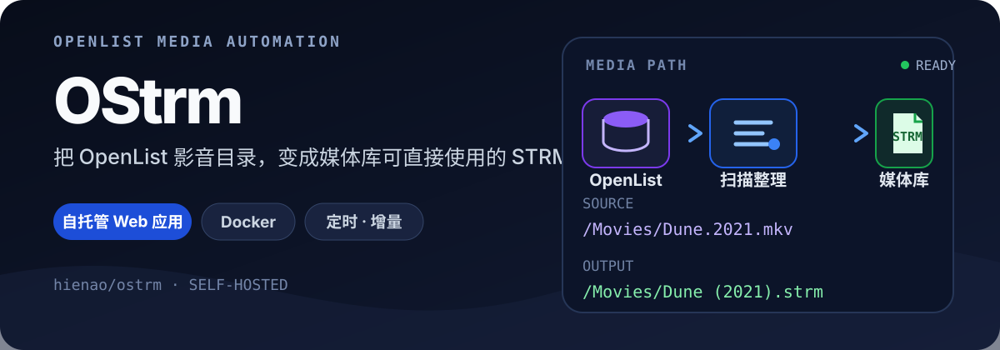

<p align="center">
  
</p>

<p align="center">
  <a href="https://github.com/hienao/ostrm/releases"></a>
  <a href="https://hub.docker.com/r/hienao6/ostrm"></a>
  <a href="https://github.com/hienao/ostrm/stargazers"></a>
  <a href="https://github.com/hienao/ostrm/blob/main/LICENSE"></a>
</p>

<p align="center">
  <a href="https://ostrm.51cloud.de/quick-start.html">快速开始</a>
  ·
  <a href="https://ostrm.51cloud.de/">完整文档</a>
  ·
  <a href="https://ostrm.51cloud.de/update-log.html">更新日志</a>
  ·
  <a href="https://github.com/hienao/ostrm/issues">问题反馈</a>
</p>

## 这是什么

OStrm 是一个面向 OpenList 影音库的自托管 Web 应用。它扫描远端目录，为视频生成轻量 `.strm` 文件，并可同步字幕、NFO、海报与背景图，让 Jellyfin、Emby 等媒体服务器无需搬运原始视频也能整理媒体库。

- **自动生成**：按 OpenList 原有目录结构输出 STRM 文件
- **智能整理**：可选 TMDB 刮削与 AI 文件名识别，补齐 NFO 和图片
- **持续更新**：支持 Cron 定时、增量更新、全量更新与孤立文件清理
- **灵活适配**：支持 Base URL 替换、URL 编码控制和多个 OpenList 配置
- **可视管理**：在 Web 界面创建任务、查看进度、筛选日志
- **便于部署**：Docker Compose 一次启动，数据与输出目录持久化

## 实际界面

<p align="center">
  
</p>

<details>
<summary><strong>查看更多界面</strong></summary>
<br>

| OpenList 配置 | 创建转换任务 |
| --- | --- |
|  |  |

| 添加 OpenList | 运行日志 |
| --- | --- |
|  |  |

</details>

## 工作方式

```text
OpenList 影音目录
      ↓ 扫描与过滤
生成 .strm 文件
      ↓ 可选处理
字幕复制 · NFO/图片复用 · TMDB/AI 刮削
      ↓
Jellyfin / Emby 等媒体库
```

首次运行可执行全量生成；后续使用增量模式和 Cron 定时任务，只处理新增或变化的内容。媒体资料按“本地已有 → OpenList 同目录 → 在线刮削”的顺序获取，减少重复请求。

## 快速开始

准备一台已安装 Docker 的设备，以及一个可访问的 OpenList 服务。创建 `docker-compose.yml`：

```yaml
services:
  ostrm:
    image: hienao6/ostrm:latest
    container_name: ostrm
    ports:
      - "3111:80"
    volumes:
      - ./data/config:/maindata/config
      - ./data/db:/maindata/db
      - ./logs:/maindata/log
      - ./strm:/app/backend/strm
    restart: always
```

启动服务：

```bash
docker compose up -d
```

打开 [http://localhost:3111](http://localhost:3111)，注册账号并完成：

1. 添加 OpenList 配置并测试连接。
2. 创建转换任务，选择源目录和 STRM 输出路径。
3. 首次执行全量生成，日常任务切换为增量更新。

更完整的部署、升级和故障排查步骤请查看[快速开始指南](https://ostrm.51cloud.de/quick-start.html)。

## 可选能力

| 能力 | 用途 | 配置指南 |
| --- | --- | --- |
| TMDB / AI 刮削 | 规范媒体名称，生成 NFO、海报和背景图 | [AI 识别配置](https://ostrm.51cloud.de/ai-recognition-config.html) |
| STRM Base URL | 为媒体服务器改写 STRM 中的访问地址 | [Base URL 配置](https://ostrm.51cloud.de/strm-base-url-config.html) |
| URL 编码控制 | 处理中文路径、空格和特殊字符 | [URL 编码配置](https://ostrm.51cloud.de/url-encoding-config.html) |
| 日志与排错 | 查看任务处理链和失败原因 | [日志说明](https://ostrm.51cloud.de/log.html) |

## 技术组成

```text
Nuxt 3 + Vue 3 + Tailwind CSS
              ↓
Spring Boot + MyBatis + Quartz
              ↓
       SQLite + 文件系统
```

运行环境使用 Java 21，生产镜像由 Docker 多阶段构建并通过 Caddy 提供 Web 服务。开发环境和目录结构请参阅[参与开发](https://ostrm.51cloud.de/dev.html)。

## 文档与支持

- [完整文档](https://ostrm.51cloud.de/)
- [常见问题](https://ostrm.51cloud.de/faq.html)
- [版本更新记录](https://ostrm.51cloud.de/update-log.html)
- [提交 Issue](https://github.com/hienao/ostrm/issues)
- [参与贡献](https://ostrm.51cloud.de/dev.html)

## 许可证

本项目采用 [GNU General Public License v3.0](./LICENSE)。你可以使用、修改和分发本项目；衍生作品需要继续采用相同许可证，并保留版权与变更说明。本项目不提供任何担保。
